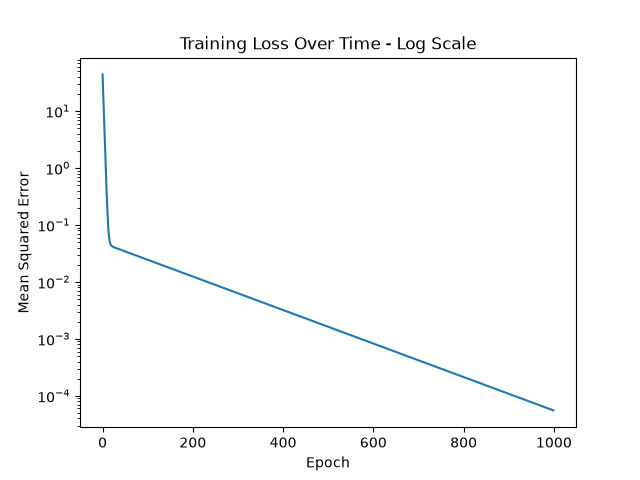
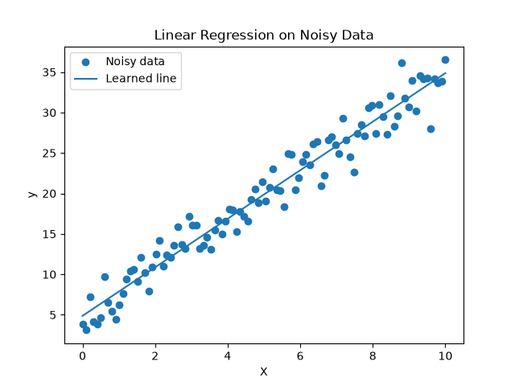

# Stage 00 — Python & NumPy Foundations

The starting point of the lab: implementing linear regression and gradient descent from scratch in NumPy. The goal isn't the model itself (a straight line is trivial) — it's to build the mental model for everything that follows: a forward pass, a loss, gradients, and a parameter update repeated in a loop.

## What's here

| File | Description |
|---|---|
| `linear_regression_numpy.py` | Linear regression on clean data (`y = 2x`), trained with gradient descent. Prints parameters/predictions and saves the loss curve. |
| `linear_regression_noisy.py` | Same model on noisy data (`y = 3x + 5 + noise`) to show that gradient descent finds the best approximation, not a perfect fit. |
| `notes.md` | Results and explanations of why the model learns. |
| `results/` | Saved plots (loss curve, fitted line). |

## The idea

Each model is trained with the same loop:

```text
y_pred = X @ w + b          # forward pass
loss   = mean((y_pred - y)^2)   # mean squared error
dw, db = gradient of loss        # backward pass
w, b   = w - lr*dw, b - lr*db    # gradient descent update
```

Repeating this drives the loss down and pulls `w`, `b` toward the relationship hidden in the data.

## Running it

From the repository root, with the virtual environment active:

```bash
python 00-python-numpy-foundations/linear_regression_numpy.py
python 00-python-numpy-foundations/linear_regression_noisy.py
```

Plots are written to `00-python-numpy-foundations/results/`.

## Results

On the clean dataset (`y = 2x`), the model converges to `w ≈ 1.995`, `b ≈ 0.017` and predicts `x = 6 → 11.99` (true value 12). The loss curve below shows the error dropping by several orders of magnitude over training:



On the noisy dataset, the fitted line recovers the underlying trend without passing through every point:


